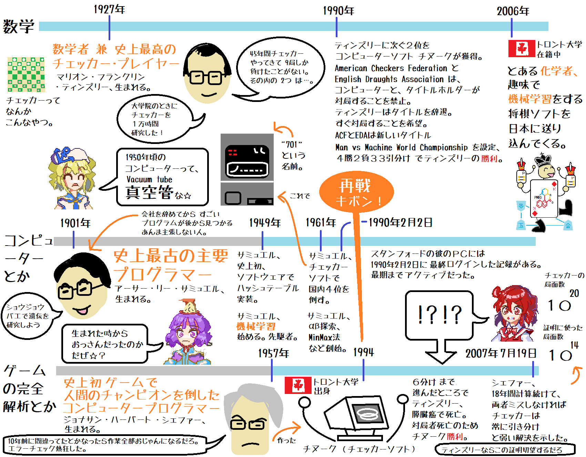
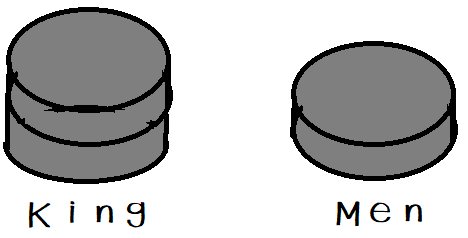
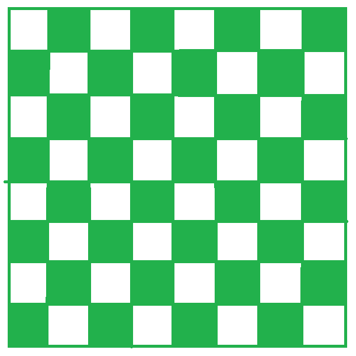
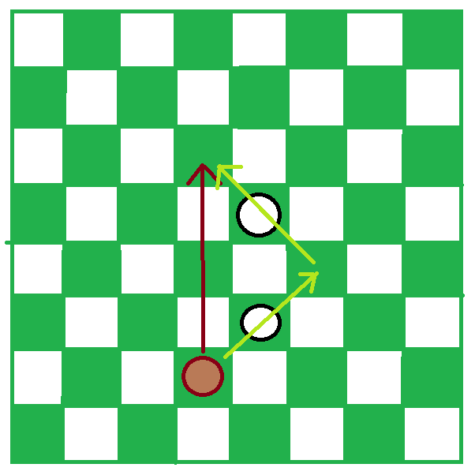
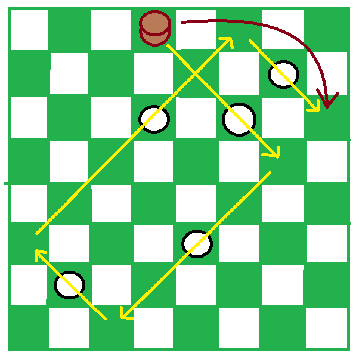

# Kifuwarabe draughts

コンピューター・チェッカー（Draughts）って、今どうなってんだぜ☆（＾～＾）？  
2007年以降知らないよな☆（＾～＾） 調べてみようぜ☆（＾～＾）？  

  
（上図: 『勉強したくない人のためのコンピューター将棋同人誌』(むずでょ)  
αβ探索は サミュエルより早い人がいたんで別々の場所で独自に創始されたというのが正しいな☆ その話しは また別のところで☆）  

## チェッカーってどんなゲームなんだぜ☆（＾～＾）？

国ごとにルールが違う……☆  

共通点のある似たようなゲームの ドラフツ、チェッカー、ダメ(駄目じゃない)を  
まとめて ドラフツ と呼んでいて、  
イギリス・ルールのやつが チェッカーだぜ☆（＾～＾）  
ティンズリーと チヌークがやってたのが チェッカー☆（＾～＾）  

まあ 天竺大将棋と小将棋を まとめて古将棋と呼ぶようなもんか……☆（＾～＾）  

  

駒は メン と キング の２種類☆（＾～＾）  
といっても物理的には メンを２つ重ねて キングだぜ☆（＾～＾）  

最初はメンしかいなくて、歩 みたいなもんでナナメ前に進むぜ☆  
キングは チェスのクイーン、将棋の龍みたいなもんだぜ☆（＾～＾）
ナナメ後ろにも進めるようになるぜ☆（＾～＾）  
基本的に メンが 盤の端に止まる、みたいなルールをこなすと キング になって、  
こいつができるとゲームが激しくなる☆（＾～＾）  
こんなけ説明してなんだが、トルコ・ルールではナナメではなく縦横に動くぜ☆（＾～＾）  

駒の色は 白、赤、黒 とか☆（＾～＾）  

駒を１個だけ飛び越すことができて、飛び越された駒は盤から取り除かれるぜ☆（＾～＾）  
全部取られるか、動くところがなくなったら 負けだぜ☆（＾～＾）  
引き分けもあるゲームだぜ☆（＾～＾）  

  

↑こいつは チェッカーの盤だぜ☆（＾～＾） ルールによって色もサイズも違う☆（＾～＾）  
基本的なルールでは　ナナメにしか動かないから、緑色のマスしか使わない☆（＾～＾）  
動画を見ると なんか縦横に駒を動かしているやつがいるが、  

  

経路を飛ばしてるからだぜ☆（＾～＾）  
行き先に飛んでから、経路の駒を取っていくのがチェッカーの  
正しい作法だぜ☆（＾～＾）  
ぴょんぴょん飛ぶのは １マスずつな☆（＾～＾）
２つの駒をいっぺんに取ることはできない☆（＾～＾）  

  

フライング・キング というルールがあるなら、  
一気に駒を取れる☆（＾～＾）これを激しいと言ってるんだぜ☆（＾～＾）  
キングを移動先に置いてから、経路の駒を取って行けだぜ☆（＾～＾）

駒を取りながら進むと、スペースが増えるので結果が変わってくるぜ☆（＾～＾）  
トルコ・ルールは 駒を取りながら進むんで もっと激しいぜ☆（＾～＾）  

チェッカーはキングも１マスずつしか進めないぜ☆（＾～＾）  

主流は **ドラフツ100** という 10x10 の盤を使った戦略性を増やしたやつで、  
入門者に向いているのは **ドラフツ64** という 8x8 の盤を使った、
激しくて短い手数で終わるやつみたいだな☆（＾～＾）  
**チェッカー** は激しさが抑えられた渋い感じらしいぜ☆（＾～＾）  

で、いろいろ説明したが ローカル・ルール いっぱいあるんで調べろだぜ☆（＾～＾）  

## コンピューター・チェッカーは今どんな感じだぜ☆（＾～＾）？

2020年現在では、これから コンピューター・ソフト作るなら、  
コンピューター・ドラフツ というくくりで [PDN 3.0](https://pdn.fmjd.org/introduction.html) という仕様があって、  
その中の チェッカー・ルール みたいな感じ☆（＾～＾）  

ただ問題はこの先にあって、Webサイトが リンク切れ になってたり、  
ダウンロードのリンクが切れてたり、回線が遅くてタイムアウトしたりして  
PDN3.0対応ソフトにアクセスしにくい状況だな☆（＾～＾）  

* [Dragon Draughts](https://mdgsoft.home.xs4all.nl/draughts/) (25-9-2017) 
  * 2 GB RAM を要求するぜ☆（＾～＾）！
  * 回線遅っ、ダウンロード終わらねっ☆（＾～＾）！
  * そして ネットワーク・エラーでソフト１つもダウンロードできねっ☆（＾～＾）！
    * こうなったらGUIも含めて自力実装するしか……☆（＾～＾）！
